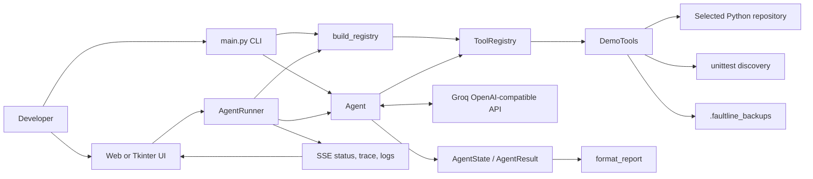

# FAULTLINE architecture

FAULTLINE is a Python debugging agent with a small, constrained tool surface. A CLI or UI supplies a repository path and bug report; the agent asks a Groq-hosted, OpenAI-compatible model to select tools, records the resulting trace, and reports whether any test invocation passed.

## Agent and state

`agent.py` defines `Agent`, which builds a chat conversation from `SYSTEM_PROMPT`, sends the registered tool schemas to the Groq endpoint through `OpenAI`, and runs a bounded loop (`max_steps`, default 12). The model chooses tool calls with `tool_choice="auto"`; the source does not hard-code a live-agent sequence. `Agent._record_observation` updates `AgentState` with inspected paths, changed paths, and test-run count, while `Agent.run` stores each result in `state.trace` and produces `AgentResult`.

`state.py` keeps presentation separate from execution. `format_report` converts an `AgentResult` into the final CLI report. Its verification label is `PASSED` only when at least one `run_tests` result reported `passed: true` during the agent run.

## Tools and registry

`main.build_registry` registers exactly three tool names: `inspect_repo`, `run_tests`, and `edit_file`. `registry.py` supplies `ToolRegistry`: it exposes these definitions as OpenAI function schemas and validates/dispatches JSON arguments through `ToolRegistry.execute`.

`tools.py` implements the handlers in `DemoTools`:

- `inspect_repo` lists non-excluded files or reads one file, subject to a 50,000-byte read limit.
- `run_tests` runs only `python -m unittest discover -v` in the selected repository, with a 30-second timeout and output cap.
- `edit_file` accepts only an existing `.py` file within the selected repository. It rejects `test_*` files and files directly under `tests`, creates a timestamped copy in `.faultline_backups`, then replaces the file content.

`DemoTools._safe_path` resolves paths and rejects any that escape the repository root. The protections are path and extension rules; they do not constitute a general sandbox for arbitrary Python code in the selected repository.

## CLI, demo repository, and UI

`main.py` parses `--demo`, `--repo`, `--bug`, `--model`, and `--max-steps`. In demo mode it points the same agent/tool stack at `demo_repo`; otherwise it uses the supplied repository. `load_dotenv` provides lightweight `.env` loading.

`demo_repo/` is the intentionally faulty Python target, not part of the agent implementation. Its `calculator.py` has the implementation under investigation and `test_calculator.py` defines the `unittest` expectations.

The root `user_interface.py` delegates to `User_Interface.__main__.main`. `User_Interface/app.py` provides a built-in HTTP server and `AgentRunner`, which runs the live agent in a background thread, broadcasts status/step/log events via Server-Sent Events, exposes manual test/inspection endpoints, and renders diffs against a backup. Its simulation mode is explicitly scripted for the calculator demo: `_run_simulation` inspects, tests, reads `calculator.py`, applies `FIXED_CALCULATOR_CODE`, and tests again. `User_Interface/desktop_app.py` provides the corresponding Tkinter interface and delegates runs to that shared runner.
